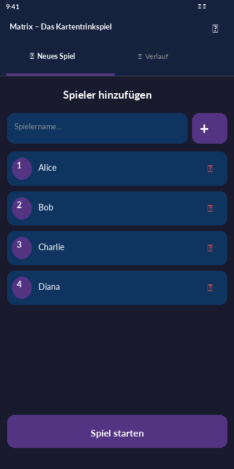
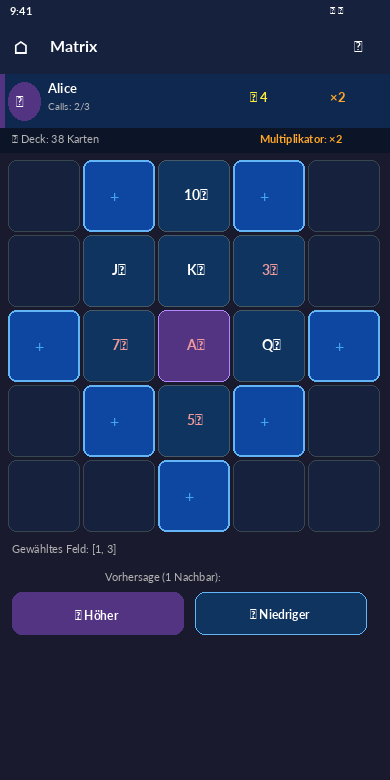
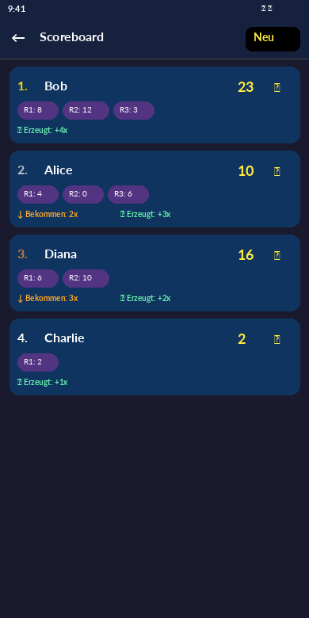
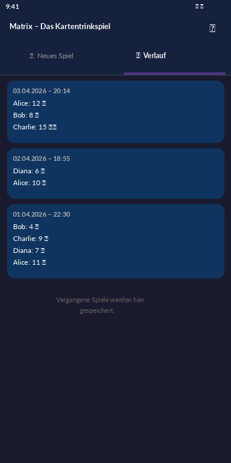
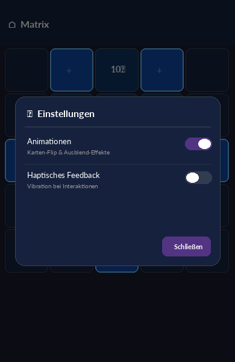
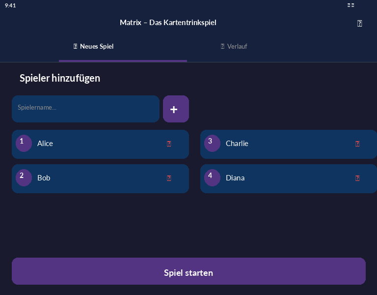
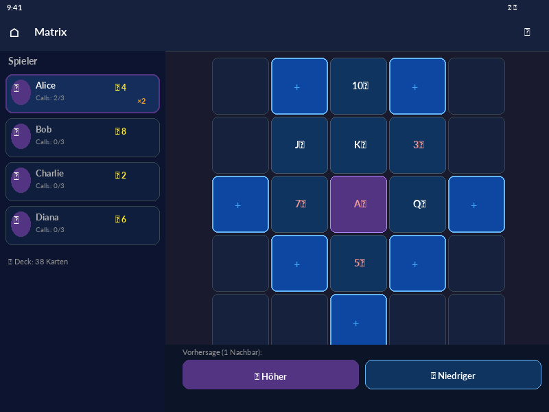
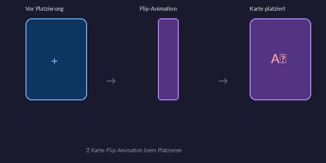
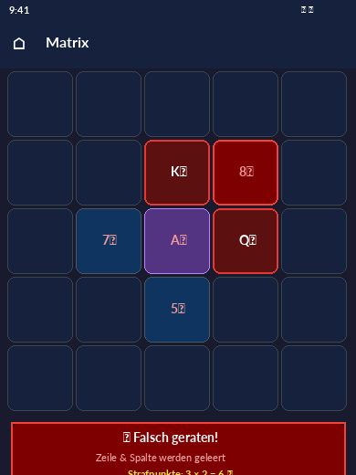

# Matrix – Das Kartentrinkspiel 🍺

Eine Flutter-App für das Kartentrinkspiel **Matrix**. Gespielt wird mit einem klassischen 52-Karten-Deck auf einem 5×5-Raster. Spieler platzieren Karten, machen Vorhersagen und sammeln Strafpunkte – je besser man trifft, desto höher der Multiplikator.

---

## Spielprinzip

Eine Startkarte (Nucleus) wird in der Mitte des 5×5-Rasters platziert. Spieler wählen reihum ein freies, gültiges Feld (angrenzend an eine bereits liegende Karte) und machen eine Vorhersage über die nächste Karte. Die Art der Vorhersage hängt von der Anzahl der Nachbarkarten ab:

| Nachbarn | Vorhersage-Optionen |
|----------|---------------------|
| 1        | Höher (▲) / Niedriger (▼) als Nachbar |
| 2        | Dazwischen / Außerhalb der Nachbar-Range |
| 3        | Hat die Farbe / Hat die Farbe nicht (mindestens einer der Nachbarn) |
| 4        | Exakte Farbe (♥ ♠ ♦ ♣) |

**Richtig geraten** → Karte wird platziert, Zug geht weiter. Nach 3 richtigen Anrufen in Folge kann der Spieler seinen Zug beenden oder weitermachen (mit Multiplikator).

**Falsch geraten** → gesamte Zeile und Spalte der Fehlposition werden geleert. Die Strafpunkte berechnen sich aus `geräumte Karten × geerbter Multiplikator`.

Das Spiel endet, wenn das Deck erschöpft ist. Gewonnen hat, wer die **wenigsten Strafpunkte** hat.

---

## Features

- 👥 Spieler-Verwaltung (beliebig viele Spieler)
- 🃏 5×5 Kartengitter mit dynamischer Positionsvalidierung
- 🎯 Kontextsensitive Guess-Buttons je nach Nachbarzahl
- 🔢 Multiplikator-System (1× – 4×), der an den nächsten Spieler weitergegeben wird
- 📊 Scoreboard mit Strafpunkten pro Runde
- 🌑 Dark-Theme mit lila Akzentfarbe

---

## Screenshots

### 📱 Smartphone

| Setup | Spielfeld | Scoreboard |
|-------|-----------|------------|
|  |  |  |

| Verlauf | Einstellungen |
|---------|---------------|
|  |  |

---

### 🖥️ Tablet (Querformat)

| Setup | Spielfeld |
|-------|-----------|
|  |  |

---

### 🎴 Animationen

Die App enthält flüssige Animationen für ein besseres Spielerlebnis:

| Karten-Flip beim Platzieren | Misserfolg & Zeilen-Räumung |
|-----------------------------|------------------------------|
|  |  |

- **Karten-Flip**: Neu platzierte Karten klappen sich mit einer 3D-Rotation auf dem Spielfeld auf.
- **Ausblend-Effekt**: Beim Misserfolg werden die betroffene Zeile und Spalte sanft ausgeblendet.
- **AnimatedContainer**: Gültige Felder und Rahmenfarben wechseln animiert (200 ms Ease-In-Out).
- Animationen können in den **Einstellungen** deaktiviert werden.

---

## Voraussetzungen

- [Flutter SDK](https://flutter.dev/docs/get-started/install) ≥ 3.0.0
- Dart SDK ≥ 3.0.0
- Android Studio / Xcode (für Emulator oder physisches Gerät)

---

## Installation & Start

```bash
# Abhängigkeiten installieren
flutter pub get

# App auf verbundenem Gerät / Emulator starten
flutter run
```

### Tests ausführen

```bash
flutter test
```

---

## Projektstruktur

```
lib/
├── domain/
│   └── models.dart          # Datenmodelle: Card, Deck, Position, Guess, Player
├── engine/
│   └── game_engine.dart     # Spiellogik: Platzierung, Guess-Auswertung, Failure-Mechanik
├── providers/
│   └── game_provider.dart   # State-Management (ChangeNotifier / Provider)
├── screens/
│   ├── setup_screen.dart    # Spieler-Verwaltung vor dem Spiel
│   ├── game_screen.dart     # Hauptspielbildschirm
│   └── scoreboard_screen.dart # Ergebnisanzeige nach dem Spiel
├── widgets/
│   ├── game_board.dart      # 5×5 Kartengitter-Widget
│   ├── guess_controls.dart  # Vorhersage-Buttons
│   └── player_info_bar.dart # Statusleiste (Spieler, Calls, Strafpunkte, Multiplikator)
└── main.dart                # App-Einstiegspunkt & Routing
```

---

## Abhängigkeiten

| Paket | Version | Verwendung |
|-------|---------|------------|
| [provider](https://pub.dev/packages/provider) | ^6.1.1 | State-Management |
| [shared_preferences](https://pub.dev/packages/shared_preferences) | ^2.2.2 | Lokale Persistenz |
| [cupertino_icons](https://pub.dev/packages/cupertino_icons) | ^1.0.6 | Icons |

---

## Architektur

Die App folgt einem **MVVM-Muster** mit Provider:

- **Model**: `domain/models.dart` und `engine/game_engine.dart` kapseln die gesamte Spiellogik und sind UI-unabhängig.
- **ViewModel**: `GameProvider` hält den gesamten App-State und stellt Methoden für die UI bereit.
- **View**: Screens und Widgets reagieren auf State-Änderungen über `context.watch` / `context.read`.
